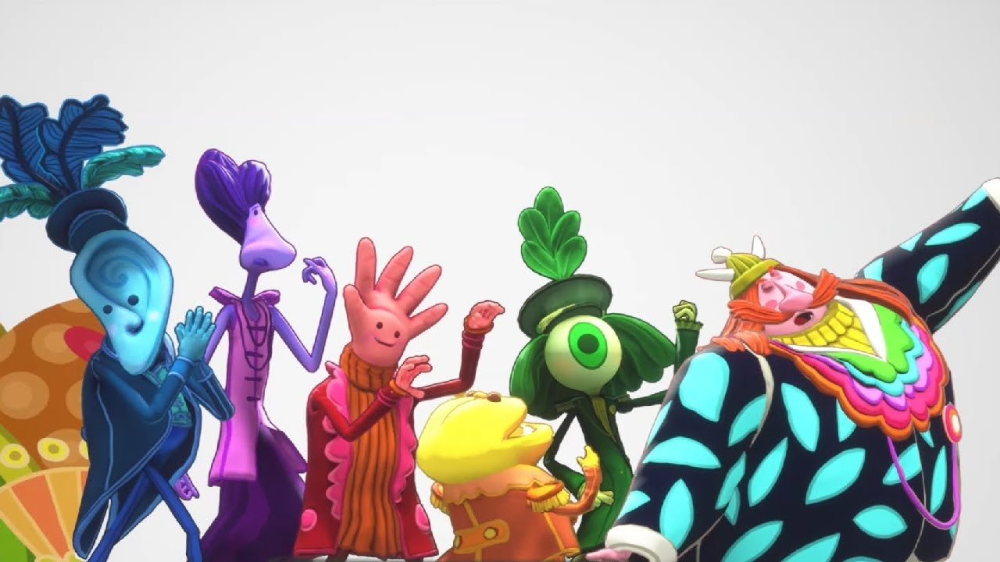
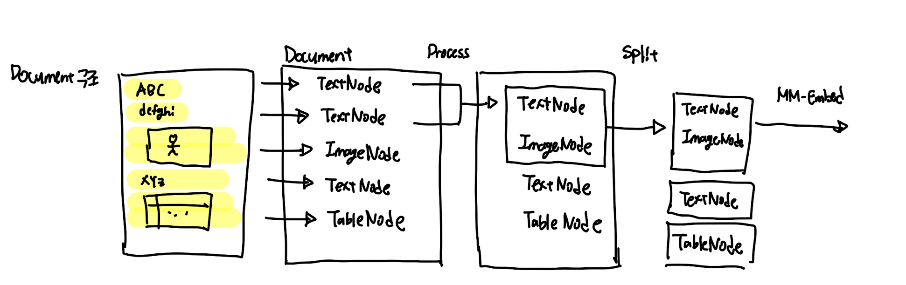
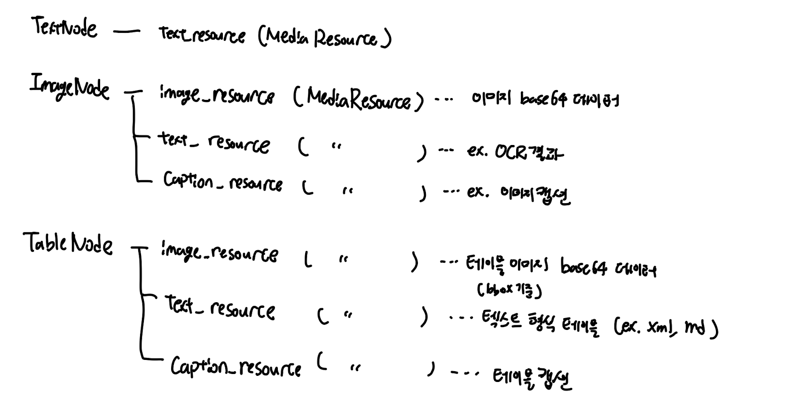
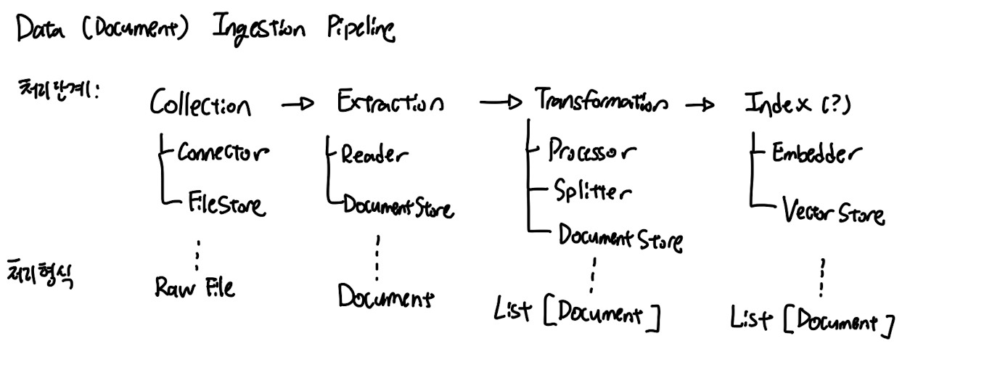

# psi-king
framework for building multi-modal first document retriever

> PSI King - King of the Senses from Psychonauts 2

## Structure
* [psiking-core](docs/psiking_core.md)

### Concepts
**Document / Node (TextNode, ImageNode, TableNode)**

* a `Document` contains a list of nodes (`document.nodes`)
* each of these can be one of the following
    * `TextNode`
    * `ImageNode`
    * `TableNode`
* schemas are defined [here](src/psiking/core)

### Pipeline Flow

## Acknowledgements
* A lot of the structure of this project was inspired by llama-index
    * https://github.com/run-llama/llama_index
* document parsing heavily utilizes docling
    * https://github.com/DS4SD/docling
* `PSI King` is a character from Psychonauts 2
    * https://www.doublefine.com/games/psychonauts-2

History of this framework's development is recorded below
* https://github.com/id4thomas/nlp_building_blocks/tree/main/projects/2024_11_arxiver_rag/experiments