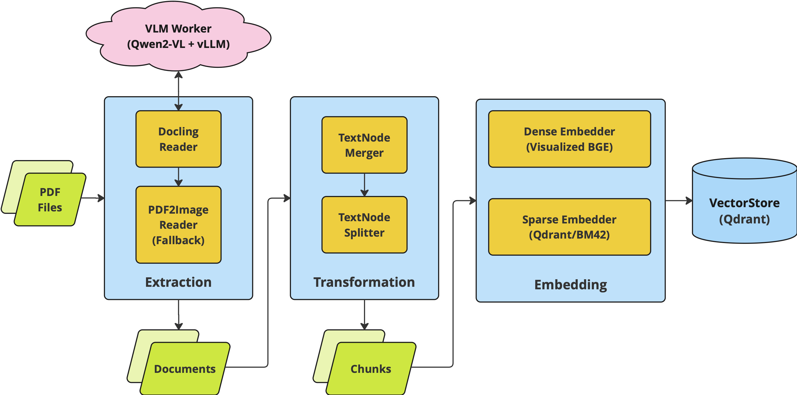

# psi-king
framework for building multi-modal first document retriever

<!-- {: width="80%" height="80%"} -->
> PSI King - King of the Senses from Psychonauts 2

## Overview
* [psiking-core docs](docs/psiking_core.md)

### Document / Node (TextNode, ImageNode, TableNode)

* a `Document` contains a list of nodes (`document.nodes`)
* each node can be one of the following types
    * `TextNode`
    * `ImageNode`
    * `TableNode`
* schemas are defined [here](src/psiking/core/base/schema.py)
    * detailed descriptions are available [here](docs/psiking_core.md)

### Pipeline Flow
Document Ingestion Flow example:
* (Doc) Collection -> Extraction -> Transformation -> Index(?)
    * Extraction: read file into `Document` instance
    * Transformation: merging/chunking/filtering
    * Index: Embedding & inserting into searchable DB

## Example
### allganize-RAG-Evaluation-Dataset-KO PDF dataset
* Reading PDF files and indexing into qdrant DB for retrieval
    * data: real-life pdf files from [`allganize-RAG-Evaluation-Dataset-KO`](https://huggingface.co/datasets/allganize/RAG-Evaluation-Dataset-KO)
        * parse using docling & pdf2image
    * models: [`Visualized_BGE` (bge-m3)](https://huggingface.co/BAAI/bge-visualized) + [Qdrant/BM42 (all_miniLM_L6_v2_with_attentions)](https://huggingface.co/Qdrant/all_miniLM_L6_v2_with_attentions)
    * db: qdrant (dense + sparse)
* ingestion pipeline: [notebook (3_3_allganize_ingestion_multimodal_hybrid)](examples/3_3_allganize_ingestion_multimodal_hybrid.ipynb)
    * use 'finance' domain PDF files

Pipeline Overview:

## Acknowledgements
* A lot of the structure of this project was inspired by llama-index
    * https://github.com/run-llama/llama_index
* document parsing heavily utilizes docling
    * https://github.com/DS4SD/docling
* `PSI King` is a character from Psychonauts 2
    * https://www.doublefine.com/games/psychonauts-2

History of this framework's development is recorded below
* https://github.com/id4thomas/nlp_building_blocks/tree/main/projects/2024_11_arxiver_rag/experiments