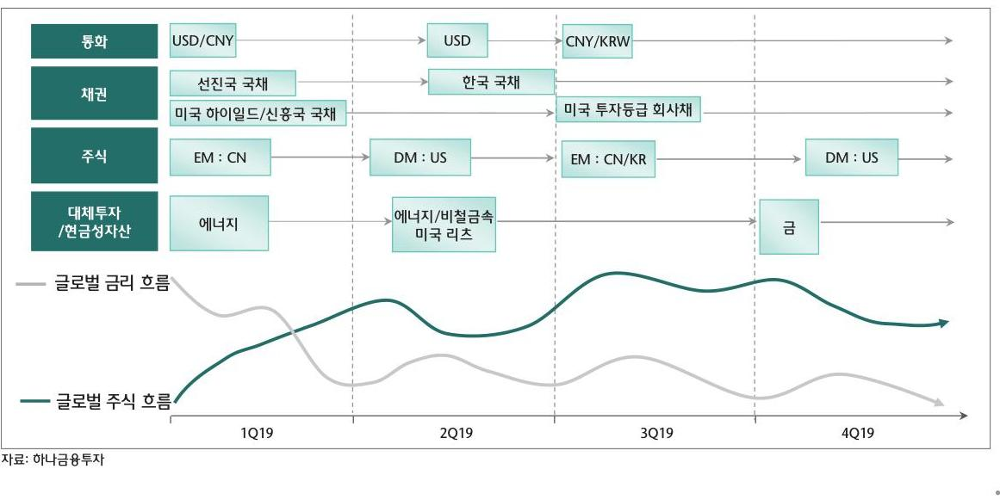
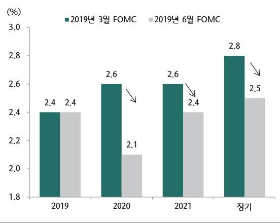
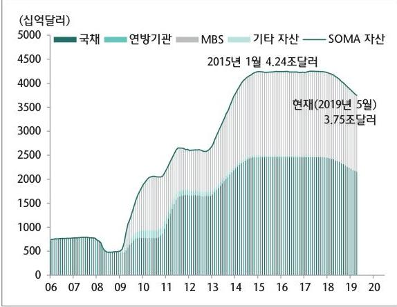

# Summary 

## late cycle 연장 국면, 위험자산군을 즐길 여유는 아직 남아있어

- 상반기 : 글로벌 경기 마장 우려에도 주요국 정책 강조 기대가 강화되면서 투자자들의 위험선호 심리 회복
- 하반기 : G2간 무역분쟁이 극단적 결말을 피해간다는 전제하에 글로벌 경기 연착륙에 대한 안도감이 부각될 전망 - 달러의 약세 압역 우위를 점하며 신용국 등 변등성이 높은 위험자산에서 일정 부분 기회를 모색

## 금융시장 양방과 상대적 자산 선호도

## 1. 글로벌 경제 및 자산배분 전망

## 미 연준의 드라마틱한 반전: 연내 보험성 금리인아 시사

- 6월 성명서에서는 경기 활동이 완만한 속도로 증가하고 있다고 평가하면서 금리결정에 인내심을 보이겠다는 문구 삭제
- 올 해 및 내년 PCE 물가지수는 각각 $1.5 \%(0.3 \% p \downarrow), 1.9 \%(0.1 \% p \downarrow)$ 로, 내년 점도표 중간값은 $2.1 \%(50 \mathrm{~b} p \downarrow)$ 로 마땅 조정
- 자산 재투자 축소 프로그램은 5월부터 국채 축소 규모를 150 억 달러로 줄이고 오는 9월 말에는 조기 종료
- 다만, 올 해 점도표 중간값을 $2.4 \%$ 로 유지하고 내년 성장률을 $2.0 \%(0.1 \% \mathrm{p} \neq)$ 로 상향 조정

## 점도표 마땅조절을 통해 금리인아 가능성 시사

자료 : FBB, 하나금융투자

미 연준의 대차대조표는 약 3.6조 수준에 머물 듯

자료 : Bloomberg, 하나금융투자