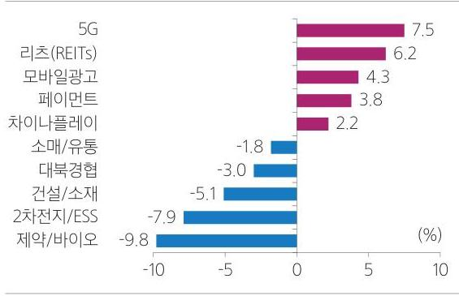

# I. 상반기 Review   KOSPI 성과 

## 시총 상위 top 10 성과

| 1) 장기 소외 낙폭과대주 반등 | 동력 | 동력 (\%) |
| :-- | :--: | :--: |
| 2) 폭 $\cdot$ 수 무역전쟁의 반사효과 | 삼성전자 | 13.7 |
| 3) 바이오주 주가 급락 | SK하이닉스 | 4.3 |
|  | 현대차 | 18.6 |
|  | 셀프리온 | -9.7 |
|  | LG화학 | -0.7 |
|  | 신한지주 | 14.1 |
|  | 현대모비스 | 16.1 |
|  | SK텔레콤 | -3.9 |
|  | POSCO | -1.6 |
|  | 삼성바이오로직스 | -19.0 |

정고: 4월 25일 증가 기준, 중력은 시총 순 정렬

|  | 2018 | 2019 YTD |
| :--: | :--: | :--: |
|  |  |  |
| DM | 국채 | 0.9 | 4.6 |
|  | IG | $-2.5$ | 7.9 |
|  | HY | $-2.1$ | 8.9 |
|  | 국채 | $-3.4$ | 3.3 |
| EM | IG | $-1.1$ | 7.7 |
|  | HY | $-4.7$ | 8.0 |

정고: 4월 25일 증가 기준
치료: Boomberg

Theme 별 성과

www.samsungpop.com ( $\mathbf{\$}$