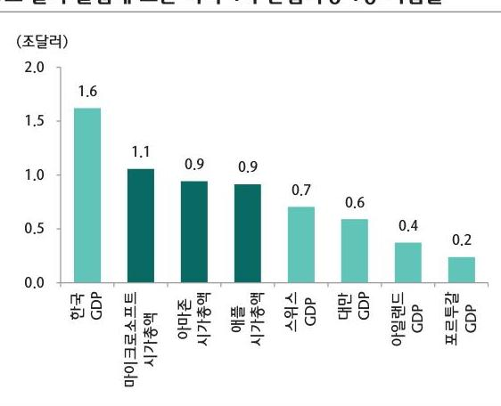

# 2019년 아반기 애외증시 전망 

## 아나금융투자 리서치센터장 조용준

## Prologue

## 새로운 10년, 거대한 투자 패러다임의 변화가 시작된다

- 2018년 8월 2일, 미국 주식시장 역사에서 최초로 매플이 시가총액 1조 달러를 돌파
- 세계를 움직이는 미국 대기업 중 상당수는 산업혁명기에 탄생하여 새로운 기술과 시장을 선도
- 4차 산업혁명의 1등 기업들이 새로운 시장 생태계를 만들어내며 새로운 부의 기회를 얻을 것으로 기대

1조 달러 클럽에 오른 미국 4차 산업혁명 1등 기업들

자료 : Bloomberg, 아나금융투자

기존 산업혁명기의 1등 기업들과 새로운 부의 기회

| 포드 자동차 (헨리 포드) |  |
| :--: | :--: |
| 유니온 스틸 (카네기) | D C UNION STEEL |
| GE (메디슨 + 모건) |  |
| AT\&T (벨 천하가) | AT\&T |

자료 : 주요 언론, 아나금융투자