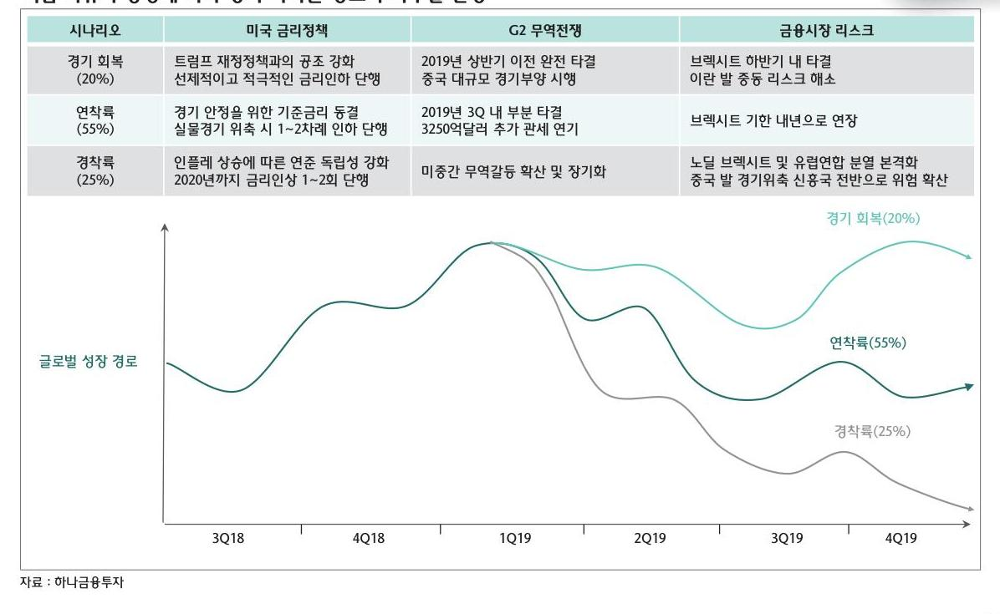
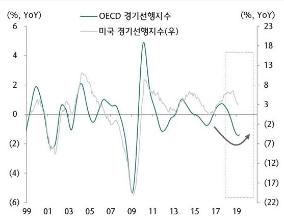
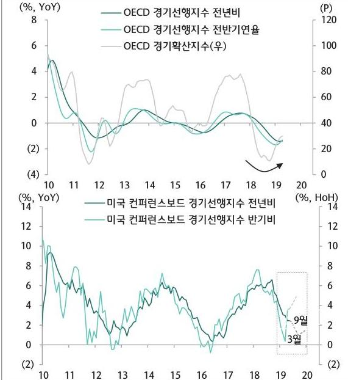

# Summary 

## 2019년 아반기 글로벌 경기 베이스 시나리오- 연착륙

## 핵심 이슈의 양방에 따라 경기 사이클 경로가 좌우될 전망

## Summary

## 2019년 아반기 이후 글로벌 경제 : Late cycle의 연장 국면

- 글로벌 경제는 지난 2018년 상반기를 기점으로 확장국면의 정점을 지나 late cycle에 진입
- 주요국 통화형택 강조 및 미증 무역분쟁 완화 등에 힘입어 late cycle의 연장 국면을 이어갈 것으로 전망
- OECD 및 미국 경기선행지수는 오는 9월 전후 바닥 형성 예상 OECD 및 미국 경기선행지수는 아반기 중 반등 예상

자료 : Bloomberg, 미나금융투자

OECD 및 미국 경기선행지수에서 포착되는 바닥 징후

주: 미국 경기선행지수 추적은 외환위기 및 서브프라임 이후 발행군 증가율 적용 자료 : FRED, 미나금융투자